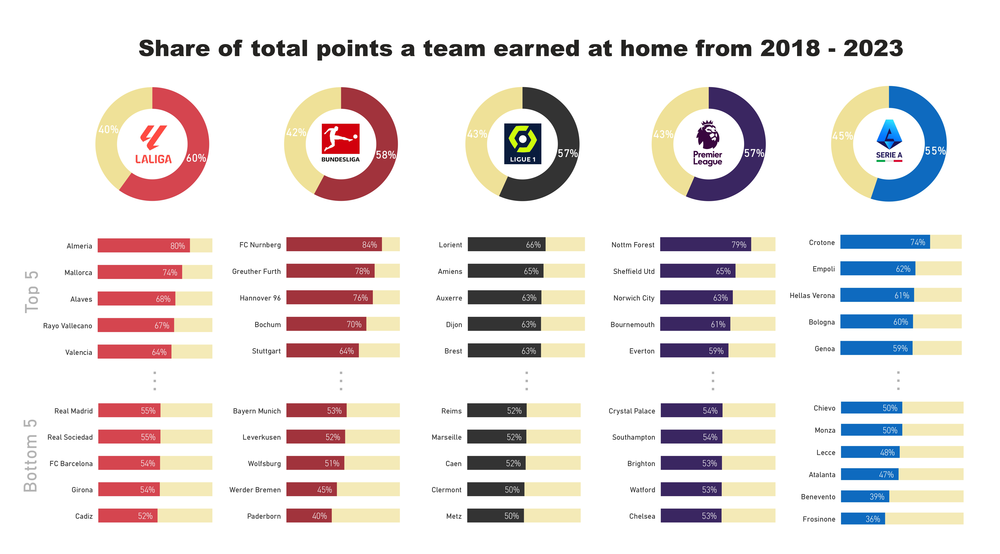

# Home advantage in the top 5 European football leagues

Data from: [soccerstats.com](https://www.soccerstats.com/)   (I used data from the top 5 European football leagues (German Bundesliga, English Premier League, Spanish La Liga, Italian Serie A, French La Ligue 1), each for the 2018/2019 - 2022/2023 seasons)  
  
Data set: [csv](Data_football_home_advantage.csv).  
  
I did some basic analyses in Python: [Jupyter Notebook](Football_home_advantage.ipynb).

# Some key results

- On average, only slight differences between the top leagues:

| Liga           | Prozent |
|----------------|---------|
| La Liga        | 60%     |
| Bundesliga     | 58%     |
| La Ligue 1     | 57%     |
| Premier League | 57%     |
| Serie A        | 55%     |

- Bundesliga has the greatest variance (Nürnberg 84%, Paderborn 40%).

- 6 clubs even have a “home disadvantage” (2x Bundesliga, 4xSerie A)

- The Bundesliga, La Ligue 1 and the Premier League show a significant drop during the Covid pandemic while La Liga was not as affected by ghost games.

  
  

I created this visualization in Power BI to share these findings in a straightforward way:

